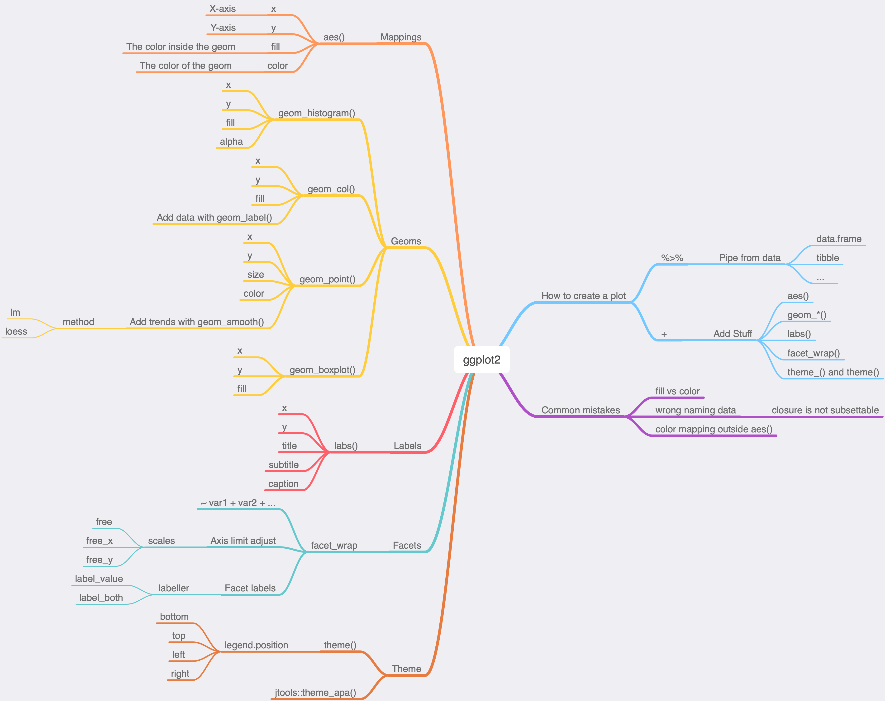

<link rel="stylesheet" href="styles.css" type="text/css">
<link rel="stylesheet" href="https://cdn.rawgit.com/jpswalsh/academicons/master/css/academicons.min.css"/>

```{r setup, include=FALSE}
knitr::opts_chunk$set(
  fig.width = 6,
  fig.asp = 0.618
)
```


# Content

This is a lesson on [ggplot2](https://ggplot2.tidyverse.org). It covers what I think is the 90% of coverage of how to create visualizations:

* Piping from data: `%>%`
* Mappings: `aes()`
* Geoms: `geom_*()`
* Labels: `labs()`
* Facets: `facet_wrap()`
* Theme Elements: `theme()`

Also what is **not covered**:

* Not all `geom_*()` are covered
* Stats as alternative ways to build layers
* Scales
* Position Adjustments
* Polar Coordinates
* Maps
* Color Palettes
* Composition (`patchwork`, `cowplot`, ...)

## [**Personas**[^1]](xaringan/Personas.html)

<div class="resp-container">
<iframe class="testiframe" src="xaringan/Personas.html">
  Please use a browser that supports iframe embedding. If you are seeing this message Google "browser iframe embedding not rendering".
</iframe>
</div>


## [**Concept Map**](something.html)

```{r out.width = "100%", echo=FALSE}

```

## [**Slides**](slides.html)

<div class="resp-container">
<iframe class="testiframe" src="xaringan/slides.html">
  Please use a browser that supports iframe embedding. If you are seeing this message Google "browser iframe embedding not rendering".
</iframe>
</div>


## [**Formative Assessment**](https://storopoli.shinyapps.io/assessment-example/)

<div class="resp-container">
<iframe class="testiframe" src="https://storopoli.shinyapps.io/assessment-example/">
  Please use a browser that supports iframe embedding. If you are seeing this message Google "browser iframe embedding not rendering".
</iframe>
</div>


# Instructor

Jose Storopoli - [ORCID](https://orcid.org/0000-0002-0559-5176)

[^1]: Pictures generated by a generative AI at [thispersondoesnotexist](https://thispersondoesnotexist.com)
