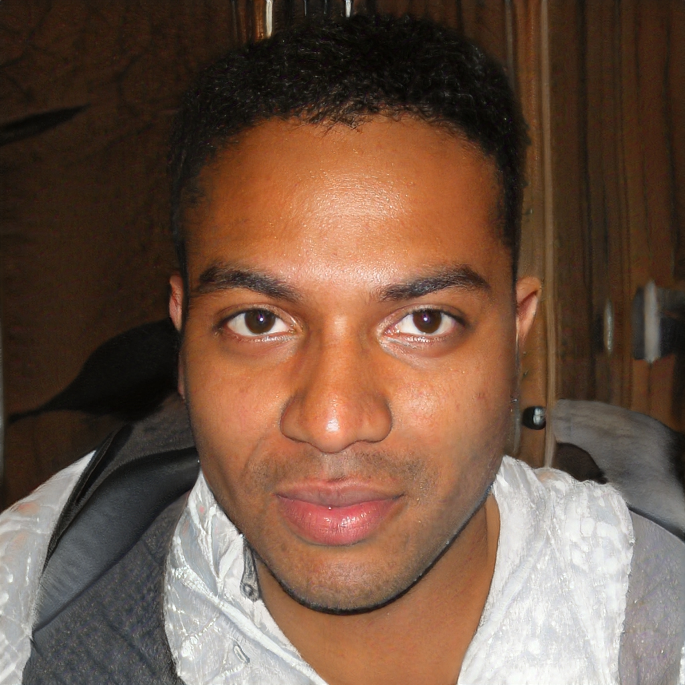
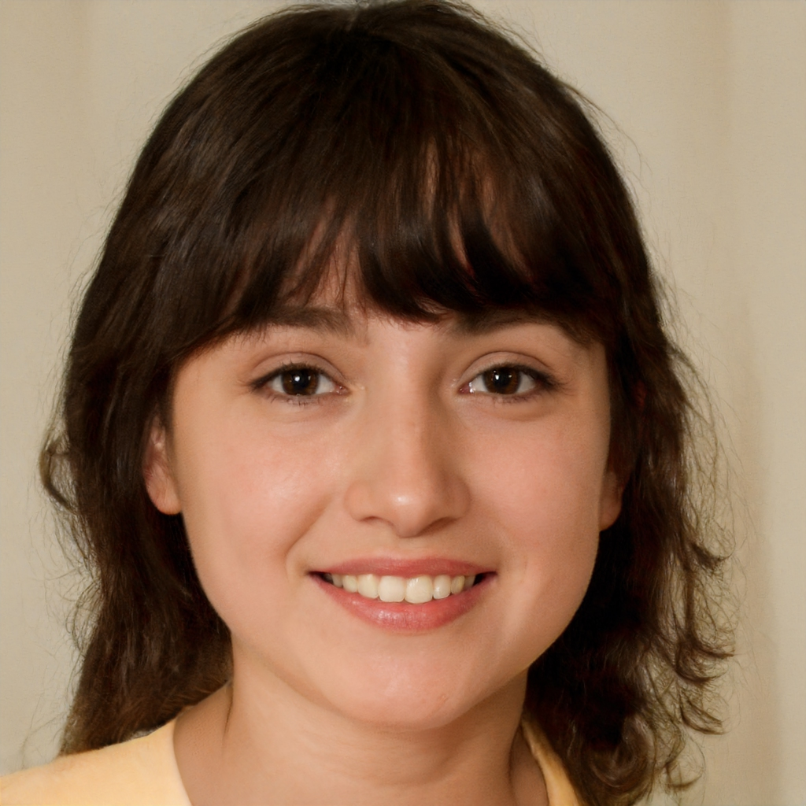
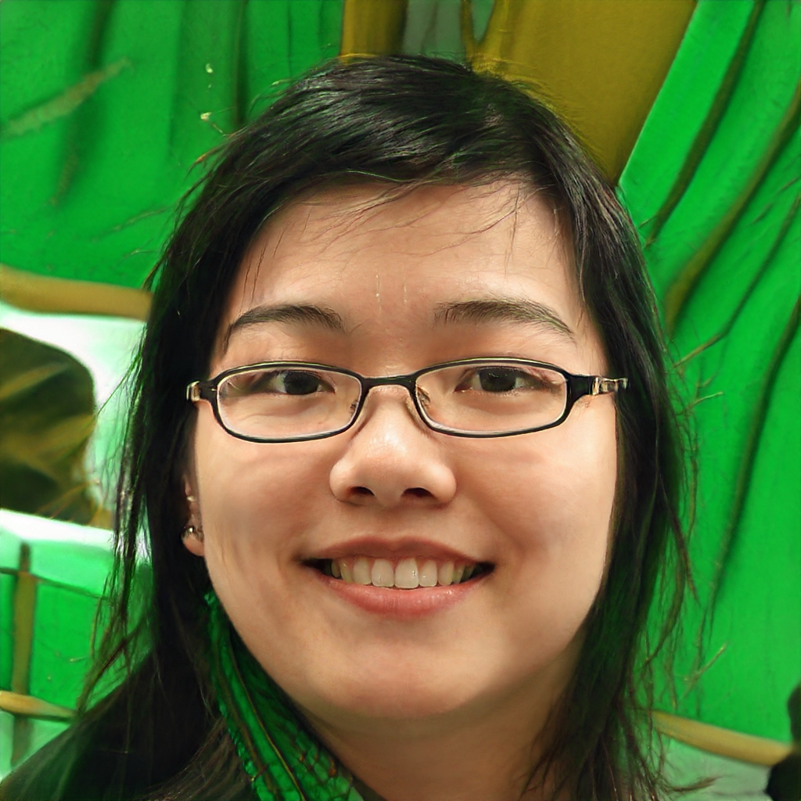

```{r setup, include=FALSE}
options(htmltools.dir.version = FALSE)
knitr::opts_chunk$set(
  fig.width = 6,
  fig.asp = 0.618
)
```

# Clark

.pull-left[

* **General Background**
  * Born and Raised in the outskirts of São Paulo - Brazil
  * Comes from a low-income family
* **Starting Point**
  * Knows basic HTML, done some freelancing as a Web Developer
  * Completed a free Udemy course of Excel
  * Learned basic tidyverse to do data tidying and manipulation
* **Needs**
  * Wants to create a portfolio of R data analysis and visualization to advance his career
* **Special Considerations**
  * Has some deficiencies in High School Math
  * Needs to be extra cautious with writing mistakes
  * Needs to leave classes 15 minutes early to not miss the last bus home
]

.pull-right[
```{r out.width = "100%", echo=FALSE}

```
]

---

# Alice

.pull-left[

* **General Background**
  * Born and Raised in Rio de Janeiro - Brazil
  * Comes from a high-income family
* **Starting Point**
  * Has done some Robotics classes in her High School
  * Has a lot of experience with Stata and SPSS
  * Has a MSc in Public Policy
  * Learned basic tidyverse to do data tidying and manipulation
* **Needs**
  * Wants to create visualizations for her PhD thesis
  * Needs to know how to format images as APA, Chicago and Harvard theme
* **Special Considerations**
  * Can be arrogant due to her upbringing
  * Does not tolerate sexist environment
]

.pull-right[
```{r out.width = "100%", echo=FALSE}

```
]

---

# Sara

.pull-left[

* **General Background**
  * Born and Raised in Recife - Brazil
  * Comes from a medium-income family
* **Starting Point**
  * Has a Bachelor degree in Computer Science
  * Knows how to program in C++
  * Has limited knowledge in statistics
  * Learned basic tidyverse to do data tidying and manipulation
* **Needs**
  * Wants to incorporate "Data Scientist" into her job title
* **Special Considerations**
  * Mostly thinks as Object-Oriented programming, and has some difficulties with pipes and functional programming
  * Distracts herself very easily
  * Is very shy and does not want to speak in front of audiences
]

.pull-right[
```{r out.width = "100%", echo=FALSE}

```
]