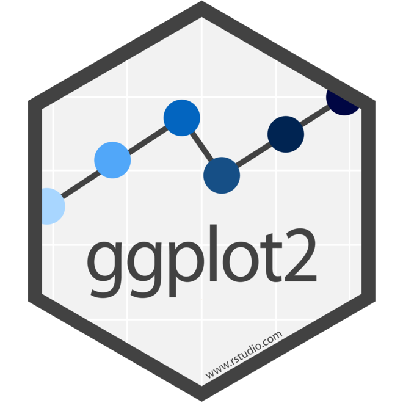

class: left

<style type="text/css">
.remark-slide-content {
    font-size: 30px;
    padding: 1em 4em 1em 4em;
}
</style>

```{r setup, include=FALSE}
options(htmltools.dir.version = FALSE)
knitr::opts_chunk$set(
  fig.width = 6,
  fig.asp = 0.618,
  fig.retina = 4
)
library(tidyverse)
mtcars <- mtcars %>% 
  as_tibble() %>% 
  mutate_at(c("vs", "am"), as.factor)
```


# `ggplot2`: How to Create Visualizations

.pull-left[
* Piping from data: `%>%`
* Mappings: `aes()`
* Geoms: `geom_*()`
* Labels: `labs()`
* Facets: `facet_wrap()`
* Theme Elements: `theme()`
]

.pull-right[
```{r ggplot2-logo, echo=FALSE}

```
]

---
# Data: `mtcars`

.pull-left[
A data frame with 32 observations on 11 (numeric) variables.

The data was extracted from the 1974 Motor Trend US magazine, and comprises fuel consumption and 10 aspects of automobile design and performance for 32 automobiles (1973–74 models).
]

.pull-right[
*	`mpg` -	MPG
*	`cyl` -	# of cylinders
*	`disp` -	Displacement
*	`hp` -	Gross horsepower
*	`drat` -	Rear axle ratio
*	`wt` -	Weight
*	`qsec` -	1/4 mile time
*	`vs` -	Engine
*	`am` -	Transmission
*	`gear` -	# forward gears
*	`carb` -	# of carburetors
]

---
class: center

# Here's how the data look

```{r mtcars-head, echo=FALSE, results='asis'}
library(gt)
head(mtcars) %>% 
  gt(rownames_to_stub = T)
```

---
class: middle
# Pipe from data `%>%`

The first step is to specify a data source to create a visualization with

.pull-left[
* In `ggplot2` you can specify first the data object then pipe into `ggplot()`
* You can use any `tibble` or `data.frame`
]

.pull-right[
```{r pipe_data, eval=FALSE}
mtcars %>% #<<
  ggplot()
```
]

---
class: middle
# Adding Stuff

With ggplot you can add layers to you visualizations with a plus sign `+`

```{r adding_stuff, eval=FALSE}
mtcars %>%
  ggplot(...) +
  layer_1 + #<<
  layer_2 + #<<
  ...       #<<
```

---
# Mappings with `aes()`

.pull-left[
* specify mappings with `aes()`
* You can put inside `ggplot()` this make all layers to inherit
* You can also specify to a specific layer or override the parent mappings from `ggplot()`
]

.pull-right[
```{r mappings, message=F}
mtcars %>% 
  ggplot(aes(x = mpg)) + #<<
  geom_histogram()
```
]

---
class: middle

# Types of mappings

They all must be specified inside the `aes()`:

* `x` - X-axis
* `y` - Y-axis
* `fill` - color inside the geom
* `label` - textual elements
* `color` - color of the geom
* `alpha` $^*$ - transparency
* `size` $^*$ - size of geom elements

\* (*if supported*)

> Remember you can specify *multiple* mappings
---

# `geom_histogram()`

Plot Histograms with `geom_histogram()`

.pull-left[
## Mappings
* `x`
* `fill`
* `alpha`
]

.pull-right[
```{r geom_histogram, message=FALSE}
mtcars %>% 
  ggplot(aes(x = mpg, fill = vs)) +
  geom_histogram(alpha = 0.5) #<<
```
]

---

# `geom_col()`

Bar Plots with `geom_col()`

.pull-left[
## Mappings
* `x`
* `y`
* `fill`
* `label` - add data with a `geom_label()`
]

.pull-right[
```{r geom_col, message=FALSE, warning=FALSE}
mtcars %>% 
  group_by(cyl) %>% 
  summarise_all(mean) %>% 
  ggplot(aes(x = cyl, y = mpg, label = round(mpg, 2))) +
  geom_col() +#<<
  geom_label() #<<
```
]

---
# `geom_point()`

Scatterplots with `geom_point()`

.pull-left[
## Mappings
* `x`
* `y`
* `size`
* `color`
* Add trends with `geom_smooth()`
]

.pull-right[
```{r geom_point, message=FALSE}
mtcars %>% 
  ggplot(aes(x = mpg, y = hp, color = vs)) +
  geom_point() + #<<
  geom_smooth() #<<
```
]

---
# `geom_boxplot()`

Boxplots with `geom_boxplot()` 

> (A statistican favorite)

.pull-left[
## Mappings
* `x`
* `y`
* `fill`
]

.pull-right[
```{r geom_boxplot, message=FALSE}
mtcars %>% 
  ggplot(aes(x = mpg, y = hp, fill = vs)) +
  geom_boxplot() #<<
```
]

---
# Labels with `labs()`

.pull-left[
## Labels
* `x`
* `y`
* `title`
* `subtitle`
* `caption`
]

.pull-right[
```{r labs, message=FALSE}
mtcars %>% 
  ggplot(aes(x = mpg, y = hp)) +
  geom_point() +
  labs( #<<
    title = "A Scatterplot", #<<
    subtitle = "Useful for seeing trends", #<<
    x = "Miles Per Gallon", #<<
    y = "Horsepower", #<<
    caption = "A" #<<
  )
```
]

---
# Labels with `labs()`

You can divide your graph into facets

.pull-left[
## Arguments
* `formula` - `~ var`
* `scales`
  * `free`
  * `free_x`
  * `free_y`
* `labeller`
  * `label_value`
  * `label_both`
]

.pull-right[
```{r facets, message=FALSE}
mtcars %>% 
  ggplot(aes(x = mpg, y = hp)) +
  geom_point() +
  facet_wrap(~ cyl, #<<
             scales = "free_y") #<<
```
]

---
# Controlling Elements

You can control your graph with `theme()`

.pull-left[
```{r themes, message=FALSE, fig.show = 'hide'}
mtcars %>% 
  ggplot(aes(x = mpg, y = hp, color = vs)) +
  geom_point() +
  geom_smooth() +
  theme( #<<
    legend.position = "bottom", #<<
    # ... a lot of more stuff #<<
  )
```
]

.pull-right[
```{r ref.label = 'themes', echo = FALSE, message=FALSE}
```
]

Check the documentation `?theme`, also for APA theme check `jtools::theme_apa()`

---
class: middle

# Common Mistakes

* Confusion between mappings `fill` vs `color`
* Calling wrong data source as `data`
  * `object of type 'closure' is not subsettable`
* `color` mapping outside `aes()`

---
class: center, middle, inverse

# Thanks!

Slides created via the R package [**xaringan**](https://github.com/yihui/xaringan).

.right[
[`r icon::fa("linkedin")` @storopoli](https://www.linkedin.com/in/storopoli/)  

[`r icon::fa("github")` @storopoli](http://github.com/storopoli)  

[`r icon::fa("paper-plane")` thestoropoli@gmail.com](mailto:thestoropoli@gmail.com)

]

---

# Session Information

```{r session-info, collapse=TRUE, size="tiny"}
sessionInfo()
```

